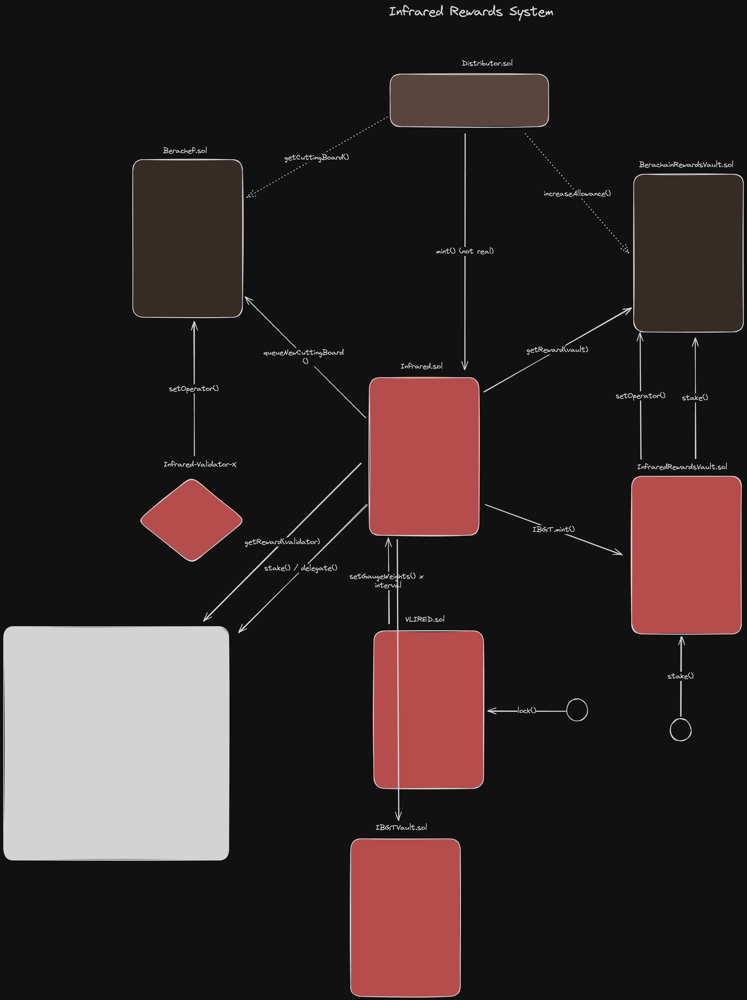

# Infrared Protocol Audit Documentation

## Introduction

The Infrared Protocol revolutionizes the way users engage with the Berachain ecosystem, particularly in how they stake consensus assets and and receive the [Proof-of-Liquidity inflation](https://docs.berachain.com/learn/what-is-proof-of-liquidity#what-is-proof-of-liquidity). It enables users to stake their assets effortlessly and receive IBGT, a liquid staked representation of BGT, significantly enhancing BGT's utility.

This README aims to provide auditors with a comprehensive overview of the Infrared Protocol, exploring its innovative architecture and the dynamics among its core components: Infrared, InfraredVault, IBGT, and IBGTVault. Each component is integral in offering a seamless liquid staking experience, allowing participants to earn rewards while ensuring liquidity within the Berachain ecosystem.

The Infrared Protocol is designed to democratize access to staking, fostering broader participation and reinforcing network security. In this document, we'll navigate through the protocol's mechanisms, smart contract functions, and the security frameworks established to safeguard user assets.

## Architecture Diagram

## Protocol Components

### Infrared

At the heart of the Infrared Protocol is the `Infrared` contract, which orchestrates the dynamic interplay between staking, rewards, and liquid staking tokens. Its primary function is to claim all BGT rewards earned by `InfraredVaults` through the staking of consensus assets. Upon receiving these rewards, `Infrared` issues IBGT tokens to the `InfraredVaults` as a liquid representation of the earned BGT, establishing a direct reward mechanism for stakers.

`Infrared` also plays a crucial role in the delegation process. It delegates the received BGT to validators that have been previously registered within the system, doing so by making deposits into the `IBeaconDepositContract`. This action is pivotal for participating in the network's consensus mechanism and securing the ecosystem.

In addition to its staking and reward mechanisms, `Infrared` is responsible for creating the `IBGTVault`. This specialized `InfraredVault` is designated to receive the rewards that validators earn, further distributing these rewards to the stakeholders. By interfacing with `IBeaconDepositContract` for validator delegation, `Infrared` ensures a streamlined and efficient process for staking, reward collection, and governance within the protocol.

Moreover, `Infrared` interacts with the `IBeraChef` contract, particularly through the `queue` function, to propose how consensus assets and their associated weights are determined for receiving BGT inflation. This interaction signifies `Infrared`'s involvement in the governance and strategic allocation of rewards.

#### Key Features:

- **Validator Management**: Enables registration, update, and removal of validators.
  - `addValidators(DataTypes.Validator[] memory _validators)`
  - `removeValidators(DataTypes.Validator[] memory _validators)`
  - `replaceValidator(DataTypes.Validator memory _current, DataTypes.Validator memory _new)`

- **Consensus Chain Deposists**: Delegates received BGT to registered valiators
    - `function delegate(bytes calldata _pubKey, uint64 _amt, bytes calldata _signature)`
    - `redelegate delegate(ytes calldata _fromPubKey, bytes calldata _toPubKey, uint64 _amt)`

- **Vault Creation**: Initiates `InfraredVault` contracts for staking different assets.
  - `registerVault(address _asset, address[] memory _rewardTokens)`

- **Reward Handling and Proposal Submission**: Manages reward distribution and proposes allocations.
  - `harvestVault(address _asset)`
  - `harvestTokenRewards(address[] memory _tokens)`
  - `queue(bytes calldata _pubKey, uint64 _startBlock, IBeraChef.Weight[] calldata _weights)`

- **IBGT Token Issuance**: Central to its operations, `Infrared` claims BGT rewards on behalf of the staked assets within `InfraredVaults`, issuing IBGT tokens as a liquid representation of these rewards.

- **Upgradiblity**:

### InfraredVault

`InfraredVault` forms the pivotal point for users to stake consensus assets, enabling participation in Berachain's Proof-of-Liquidity (POL) rewards system. Each vault is designed for a specific asset, allowing stakeholders to earn rewards denominated in IBGT, a liquid token representing staked BGT.

A key operation of `InfraredVault` is its automatic restaking of deposits into the corresponding `IBerachainRewardsVault` to accrue BGT rewards. Crucially, `Infrared` is designated as the recipient of these rewards; subsequently, it issues IBGT back to the vault, directly rewarding stakers.

Additionally, `InfraredVault` leverages a `MultiRewards` mechanism, influenced by Synthetix and Curve.fi, to manage multiple types of reward tokens. This strategy broadens the spectrum of rewards, enhancing the value proposition for participants. In instances where a `IBerachainRewardsVault` has not been associated at creation, `Infrared` possesses the capability to invoke a migration process. This procedure stakes all existing deposits and configures `Infrared` as the rewards operator, ensuring seamless reward distribution and alignment with the broader ecosystem incentives.

#### Key Features:

- **Asset-Specific Staking**: Tailored vaults for distinct consensus assets, fostering targeted participation in the POL rewards.
    - Staking Interface: `function stake(uint256 amount) external`
    - Withdrawal Interface: `function withdraw(uint256 amount) external`

- **Integrated Restaking**: Automatic restaking into `IBerachainRewardsVault` for BGT reward accrual, with `Infrared` as the designated reward collector.
    - `function onStake(uint256 amount)`
    - `function onWithdraw(uint256 amount)`

- **IBGT Reward Issuance**: Direct issuance of IBGT to stakers, mirroring the collected BGT rewards, enhancing liquidity and reward accessibility.
    - Reward Claim Interface: `function getReward() external`

- **Multi-Reward Management**: Adoption of a `MultiRewards` strategy to accommodate various reward tokens, enriching the staking rewards landscape.
    - Add Reward Token Interface: `function addReward(address _rewardsToken, uint256 _rewardsDuration) external onlyInfrared`
    - Notify Reward Amount Interface: `function notifyRewardAmount(address _rewardToken, uint256 _reward) external onlyInfrared`

- **Dynamic Migration Capability**: Provision for late-stage integration with `IBerachainRewardsVault`, reinforcing the protocol's adaptability and reward optimization.
    - Migration Interface (for adapting to new reward structures): `function migrate() external`

### IBGT

`IBGT` acts as the cornerstone of the Infrared protocol's reward mechanism, encapsulating BGT rewards in a liquid, transferable form. As the tokenized representation of staked BGT rewards, `IBGT` facilitates seamless interactions across the Infrared ecosystem, enabling users to engage more dynamically with the rewards they earn.

#### Key Features:

- **Tokenized BGT Rewards**: Offers a fluid representation of BGT rewards, enhancing the user's ability to utilize their earnings within and beyond the Infrared ecosystem.
    - ERC20 Standard Compliance: Ensures interoperability with the broader Ethereum ecosystem.

- **Minting and Burning Mechanism**: Empowers the Infrared protocol to accurately reflect the accrual and distribution of rewards.
    - Minting Interface: `function mint(address to, uint256 amount) external` (Accessible only by roles allowed to mint tokens)
    - Burning Interface: `function burn(uint256 amount) external` and `function burnFrom(address account, uint256 amount) external` (Allowing users or approved entities to reduce supply, aligning with reward payouts or corrections)

The `IBGT` contract, through its minting and burning capabilities, underpins the transparent and flexible management of rewards within the Infrared ecosystem. This approach not only streamlines reward distribution but also aligns with the protocol’s goal of enhancing liquidity and utility for BGT stakers.

## Audit Focus Areas

Auditors are advised to concentrate on several critical aspects:

1. **Contract Security**: Examination of contracts for vulnerabilities or logic errors.
2. **Inter-Contract Interactions**: Analysis of contract interactions for potential issues or inefficiencies.
3. **Reward Distribution**: Verification of reward logic to ensure fairness and resistance to manipulation.
4. **Governance and Upgradability**: Evaluation of governance processes for contract upgrades and parameter management.

